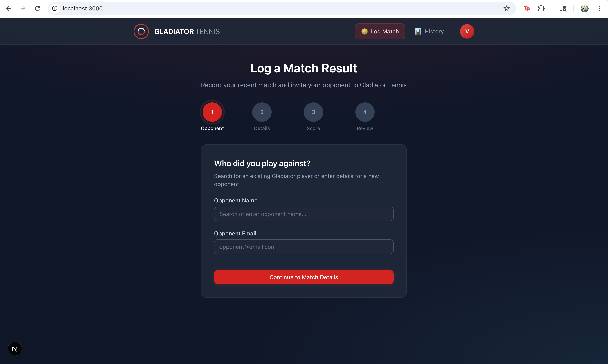
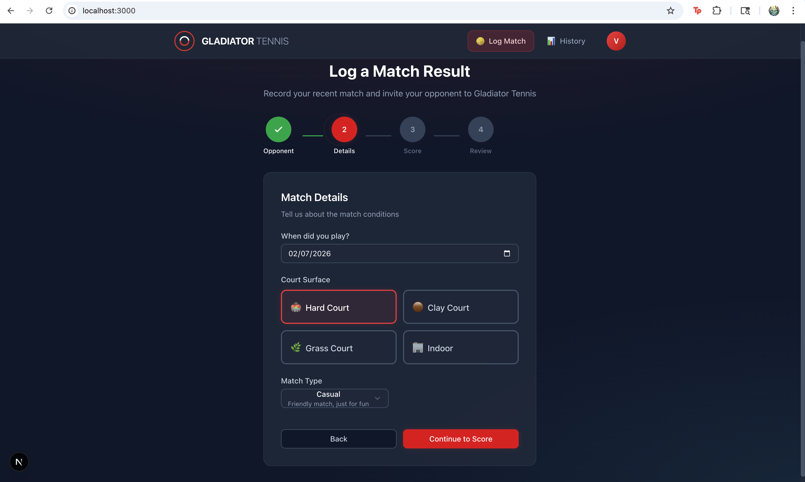
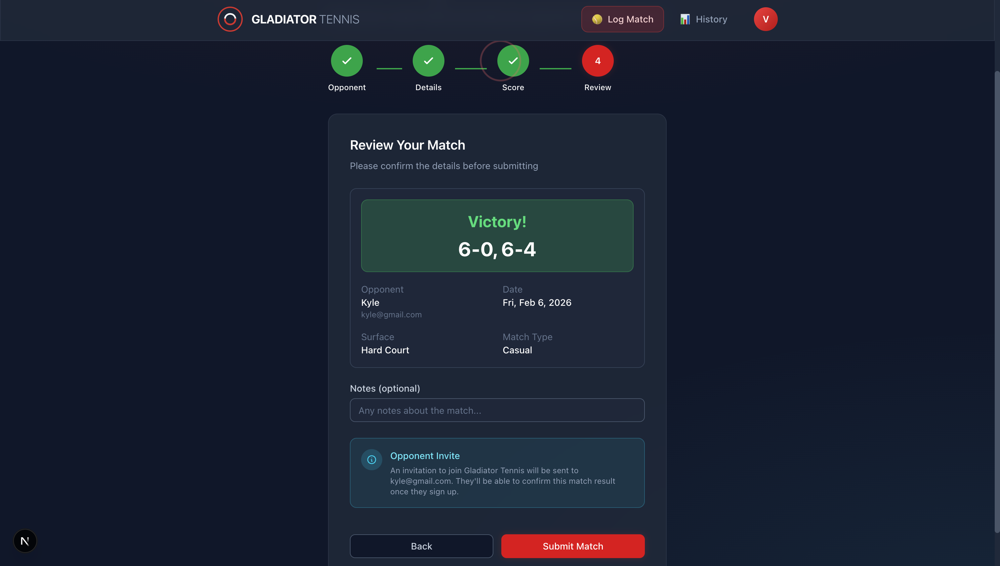
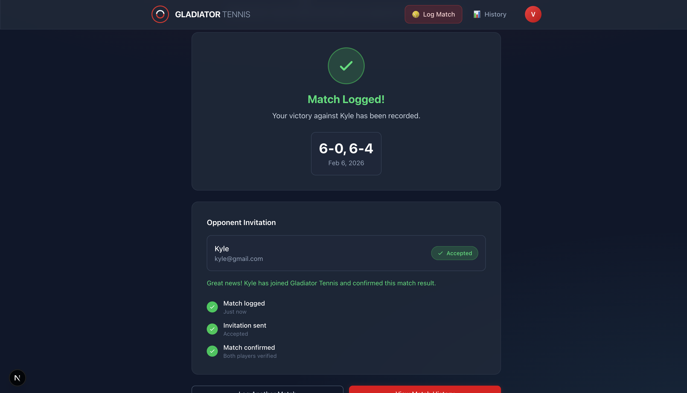
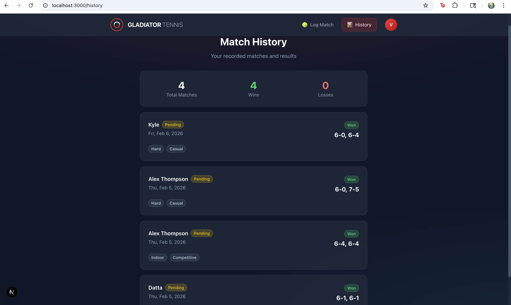

# Gladiator Tennis - Match Logger

A React-based web application for logging tennis match results against opponents who are not yet on the Gladiator Tennis platform. This flow initiates an invite to the opponent and tracks the invitation status.

## Table of Contents

- [Overview](#overview)
- [Tech Stack](#tech-stack)
- [Project Structure](#project-structure)
- [Getting Started](#getting-started)
- [Testing](#testing)
- [Features](#features)
- [Screenshots](#screenshots)
- [Architecture Decisions](#architecture-decisions)
- [AI Usage Documentation](#ai-usage-documentation)

---

## Overview

This application implements the "Report Match Result" flow for Gladiator Tennis, allowing users to:

1. Log a tennis match played against someone outside the platform
2. Trigger an invitation to the opponent to join Gladiator Tennis
3. Track the invitation status (Invited -> Accepted)
4. View match history with persistence across sessions

---

## Tech Stack

| Technology | Purpose |
|------------|---------|
| **Next.js 16** | React framework with App Router |
| **TypeScript** | Type safety and developer experience |
| **Tailwind CSS** | Utility-first styling |
| **shadcn/ui** | Pre-built accessible UI components |
| **Framer Motion** | Fluid animations and transitions |
| **Jest** | Testing framework |
| **React Testing Library** | Component testing utilities |
| **localStorage** | Client-side data persistence |

---

## Project Structure

```
gladiator-match-logger/
├── src/
│   ├── app/                          # Next.js App Router
│   │   ├── layout.tsx                # Root layout with fonts and metadata
│   │   ├── page.tsx                  # Home page - Match logging form
│   │   ├── history/
│   │   │   └── page.tsx              # Match history page
│   │   └── globals.css               # Global styles and dark theme
│   │
│   ├── components/
│   │   ├── ui/                       # shadcn/ui components
│   │   │   ├── button.tsx
│   │   │   ├── input.tsx
│   │   │   ├── label.tsx
│   │   │   ├── badge.tsx
│   │   │   └── select.tsx
│   │   │
│   │   ├── match-form/               # Multi-step form components
│   │   │   ├── OpponentStep.tsx      # Step 1: Opponent name and email
│   │   │   ├── MatchDetailsStep.tsx  # Step 2: Date, surface, match type
│   │   │   ├── ScoreStep.tsx         # Step 3: Set scores with validation
│   │   │   ├── ReviewStep.tsx        # Step 4: Review and submit
│   │   │   ├── ConfirmationState.tsx # Success state with invite timeline
│   │   │   └── StepIndicator.tsx     # Progress indicator
│   │   │
│   │   ├── Header.tsx                # Navigation header with logo
│   │   └── MatchHistory.tsx          # Match history list component
│   │
│   ├── context/
│   │   └── MatchFormContext.tsx      # Form state management with React Context
│   │
│   ├── lib/
│   │   ├── mock-data.ts              # Mock players and localStorage helpers
│   │   ├── tennis-validation.ts      # Tennis score validation logic
│   │   └── utils.ts                  # Utility functions (cn helper)
│   │
│   ├── types/
│   │   └── index.ts                  # TypeScript type definitions
│   │
│   └── __tests__/                    # Test suite
│       ├── tennis-validation.test.ts # Tennis scoring tests
│       ├── mock-data.test.ts         # Helper function tests
│       ├── MatchFormContext.test.tsx # Context tests
│       └── components/               # Component tests
│           ├── OpponentStep.test.tsx
│           └── MatchHistory.test.tsx
│
├── public/                           # Static assets
├── screenshots/                      # Application screenshots
├── jest.config.js                    # Jest configuration
├── jest.setup.js                     # Jest setup file
├── components.json                   # shadcn/ui configuration
├── tailwind.config.ts                # Tailwind configuration
├── tsconfig.json                     # TypeScript configuration
└── package.json                      # Dependencies and scripts
```

---

## Getting Started

### Prerequisites

- Node.js 18.x or higher
- npm or yarn package manager

### Installation

1. Clone the repository:
   ```bash
   git clone <repository-url>
   cd gladiator-match-logger
   ```

2. Install dependencies:
   ```bash
   npm install
   ```

3. Start the development server:
   ```bash
   npm run dev
   ```

4. Open your browser and navigate to:
   ```
   http://localhost:3000
   ```

### Build for Production

```bash
npm run build
npm start
```

---

## Testing

The project includes a comprehensive test suite using Jest and React Testing Library.

### Running Tests

```bash
# Run all tests
npm test

# Run tests in watch mode
npm run test:watch

# Run tests with coverage report
npm run test:coverage
```

### Test Coverage

The test suite includes **125 tests** covering:

| Category | Tests | Description |
|----------|-------|-------------|
| **Tennis Validation** | 32 | Set score validation, tiebreak rules, match result calculation |
| **Mock Data Helpers** | 22 | Player search, API simulation, ID generation |
| **Form Context** | 32 | State management, step navigation, form updates |
| **OpponentStep** | 9 | Input validation, error messages, form rendering |
| **MatchHistory** | 20 | Loading states, empty states, match display, error handling |

### Test Structure

```
src/__tests__/
├── tennis-validation.test.ts      # Tennis scoring logic tests
├── mock-data.test.ts              # Helper function tests
├── MatchFormContext.test.tsx      # Context and state tests
└── components/
    ├── OpponentStep.test.tsx      # Form component tests
    └── MatchHistory.test.tsx      # History component tests
```

---

## Features

### Multi-Step Match Logging Form

The form is divided into 4 steps for better user experience:

1. **Opponent Step**: Enter opponent name and email. Supports searching existing players or adding new opponents who will receive an invite.

2. **Match Details Step**: Select match date (cannot be in the future), court surface (Hard, Clay, Grass, Indoor), and match type (Casual, Competitive, League, Tournament).

3. **Score Step**: Enter set scores with tennis-specific validation:
   - Valid scores: 6-0 through 6-4, 7-5, 7-6
   - Tiebreak input appears automatically for 7-6 scores
   - Automatically detects if a third set is needed (1-1 in sets)
   - Calculates match winner based on sets won

4. **Review Step**: Confirm all details before submission with optional notes field.

### Opponent Invite Flow

When logging a match against a non-Gladiator player:
- An invitation is triggered to the opponent's email
- Status starts as "Invited" (pending)
- Status changes to "Accepted" when opponent joins (simulated after 5 seconds for demo)
- Visual timeline shows: Match logged -> Invite sent -> Match confirmed

### Match History

- Displays all logged matches sorted by date (newest first)
- Shows win/loss statistics summary
- Each match card displays:
  - Opponent name and invite status
  - Match date and score
  - Court surface and match type
  - Optional notes

### Data Persistence

- Matches are stored in localStorage
- Data persists across browser sessions
- No backend required for the demo

### Loading, Error, and Empty States

- Skeleton loaders during data fetching
- Error states with retry functionality
- Empty state with call-to-action when no matches exist

---

## Screenshots

### Step 1: Opponent Information



Enter the opponent's name and email address. The email field shows a helper message indicating an invite will be sent.

### Step 2: Match Details



Select the match date, court surface (with visual icons), and match type. The date picker prevents selecting future dates.

### Step 3: Review and Submit



Review all match details before submission. Shows the result banner (Victory/Defeat), opponent invite notice, and allows adding optional notes.

### Step 4: Confirmation State



Success screen with animated checkmark. Shows opponent invitation status timeline that updates from "Invited" to "Accepted" after 5 seconds (simulated for demo).

### Match History



View all logged matches with statistics summary (Total Matches, Wins, Losses). Each match card shows opponent status badge, score, surface, and match type.

---

## Architecture Decisions

### Why Multi-Step Form?

- Reduces cognitive load by focusing on one task at a time
- Allows for step-specific validation
- Better mobile experience with smaller forms per screen
- Progress indicator shows completion status

### Why React Context for Form State?

- Preserves form data when navigating between steps
- Centralized state management without external libraries
- Easy to extend with additional form fields
- Clean separation of concerns

### Why localStorage?

- Appropriate for exercise scope
- No backend setup required
- Demonstrates persistence requirement
- Easy to replace with API calls later

### Why Framer Motion?

- Smooth page transitions between form steps
- Micro-interactions enhance user feedback
- Animated success state feels more polished
- Easy-to-use declarative API

### Tennis Score Validation

Implemented proper tennis scoring rules:
- Winner must have 6+ games with 2-game lead (6-0, 6-1, 6-2, 6-3, 6-4)
- Or win 7-5 or 7-6 (tiebreak)
- Tiebreak scores validated for 7-6 sets
- Match winner determined by sets won (best of 3)

---

## AI Usage Documentation

This project was built with AI assistance. See [PROMPTS.md](../PROMPTS.md) for the complete documentation of prompts used during development.

### Summary of AI-Assisted Work

**What AI helped with:**
- Project scaffolding and structure
- Tennis score validation logic
- Multi-step form implementation
- Dark theme styling based on reference screenshot
- Framer Motion animations
- Component boilerplate code

**What I decided independently:**
- Chose multi-step form over single long form for better UX
- Scoped to singles matches only
- Used localStorage instead of a database
- Kept invite status simulation simple (5-second timer)
- Adjusted animations to be subtle rather than flashy

**Iterations required:**
- Tennis scoring validation needed refinement to handle all edge cases
- Opponent invite flow clarified based on recruiter feedback
- UI styling adjusted to match Gladiator Tennis aesthetic

---

## Requirements Checklist

### Baseline Requirements
- [x] Basic responsive layout
- [x] Clear state management (React Context)
- [x] At least one async data flow (simulated API calls)
- [x] Thoughtful loading, error, and empty states
- [x] Sensible UX decisions and validation
- [x] Readable, organized code

### Option A Specific Requirements
- [x] Form-based flow with required fields
- [x] Clear validation and error messaging
- [x] Confirmation state after submit
- [x] Match scores persist between sessions (localStorage)
- [x] Opponent invite states modeled (Invited / Invitation Accepted)

---

## What I Would Improve With More Time

Given more time, I would add a real backend with database persistence instead of localStorage, and implement actual email delivery for opponent invites. I would also add user authentication, the ability to edit or delete matches, and end-to-end tests with Playwright. Finally, I would improve the mobile experience with better touch interactions and add doubles match support.

---

## License

This project was created as a take-home assignment for Gladiator Tennis.
